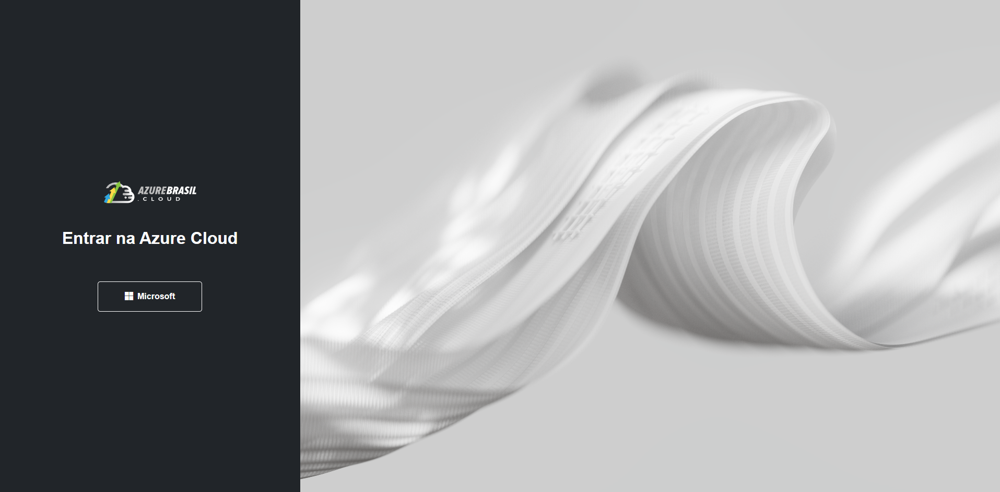
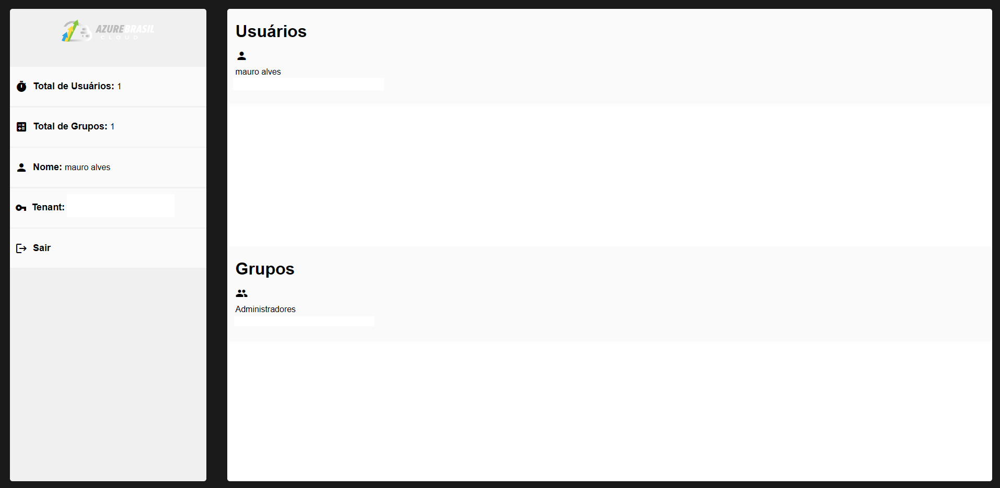

## 1. Pré-requisitos Essenciais

### Node.js e npm

- **Download:** [Node.js Oficial](https://nodejs.org)

  - Baixe versão 22 do node.js e execute o instalador apropriado para seu sistema operacional.
  - O npm será instalado automaticamente.

### .NET 8 SDK

- **Download:** [.NET 8 SDK](https://dotnet.microsoft.com/en-us/download/dotnet/8.0)
  - Baixe e execute o instalador para seu sistema operacional.

## 2. Configuração e Execução da Aplicação

   **Configurar Microsoft Entra ID - API**:
   - Verifique no `appsettings.Development.json` e ajuste as credenciais do **Client ID** e **Tenant ID**.

   **Configurar Microsoft Entra ID - Front**:
   - Verifique no `msl.config.ts` e ajuste as credenciais do **Client ID**.

## 3. Clonar o Repositório

```bash
git clone https://github.com/MauroAlvess/microsoft_authentication
cd microsft-authetication
```

## Backend 

1. **Navegue para o diretório da API**:
    ```bash
    cd azure-cloud-api
    ```

2. **Restaurar dependências**:
    ```bash
    dotnet restore
    ```
4. **Executar o backend**:
    ```bash
    dotnet run
    ```
---

## Frontend 

1. **Navegue para o diretório do frontend**:
    ```bash
    cd ../azure-cloud-ui
    ```

2. **Instalar as dependências do Angular**:
    ```bash
    npm install
    ```

4. **Executar o frontend**:
    ```bash
    ng serve
    ```
    
---

