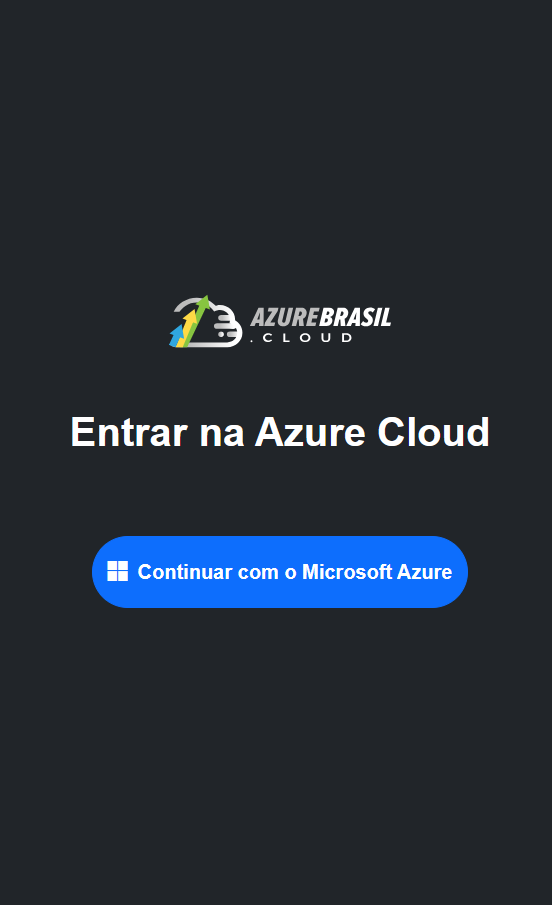

# Manual de Utilização da Aplicação Azure Cloud

<p align="center">
  
</p>

Bem-vindo ao **Manual de Utilização da Aplicação Azure Cloud**!

Este guia detalhado o ajudará a configurar e executar tanto o frontend (desenvolvido em Angular) quanto o backend (desenvolvido em .NET 8) da sua aplicação em seu ambiente local.

## 1. Visão Geral da Aplicação
Nossa aplicação Azure Cloud é modular, composta por duas partes principais que trabalham em conjunto:

- **azure-cloud-ui (Frontend - Angular):** Interface do usuário responsável por apresentar os dados e as funcionalidades, comunicando-se diretamente com o backend.
- **azure-cloud-api (Backend - .NET 8):** API que processa as requisições do frontend, interage com o **Microsoft Entra ID** e obtém as informações do Azure.

A autenticação de usuários ocorre via **Microsoft Entra ID**, garantindo segurança no acesso às informações do Azure.

## 2. Pré-requisitos Essenciais

### 2.1. Node.js e npm
O Node.js é necessário para o frontend Angular, e o npm gerencia as dependências.

- **Download:** [Node.js Oficial](https://nodejs.org)
- **Instalação:**
  - Baixe e execute o instalador apropriado para seu sistema operacional.
  - O npm será instalado automaticamente.

### 2.2. .NET 8 SDK
O .NET 8 SDK permite compilar e executar o backend.

- **Download:** [.NET 8 SDK](https://dotnet.microsoft.com/en-us/download/dotnet/8.0)
- **Instalação:** Baixe e execute o instalador para seu sistema operacional.

## 3. Configuração e Execução da Aplicação

### 3.1. Clonar o Repositório

```bash
git clone (https://github.com/MauroAlvess/microsoft_authentication)
cd microsft-authetication
```

## 3.2. Backend (`azure-cloud-api`)

1. **Navegue para o diretório da API**:
    ```bash
    cd azure-cloud-api
    ```

2. **Restaurar dependências**:
    ```bash
    dotnet restore
    ```

3. **Configurar Microsoft Entra ID**:
   - Verifique `appsettings.Development.json` e ajuste as credenciais do **Client ID** e **Tenant ID**.

4. **Executar o backend**:
    ```bash
    dotnet run
    ```
    - O backend será iniciado. Você verá no terminal um endereço como `https://localhost:44351`.

---

## 3.3. Frontend (`azure-cloud-ui`)

1. **Navegue para o diretório do frontend**:
    ```bash
    cd ../azure-cloud-ui
    ```

2. **Instalar as dependências do Angular**:
    ```bash
    npm install
    ```

3. **Configurar ambiente**:
   - Verifique `src/environments/environment.ts` e ajuste o endereço da API backend.

4. **Executar o frontend**:
    ```bash
    ng serve
    ```

---

## 4. Acessando a Aplicação

1. **Abra seu navegador**.
2. **Digite**: http://localhost:4200

## 5. Faça login via Microsoft Entra ID** e acesse as informações do Azure.

